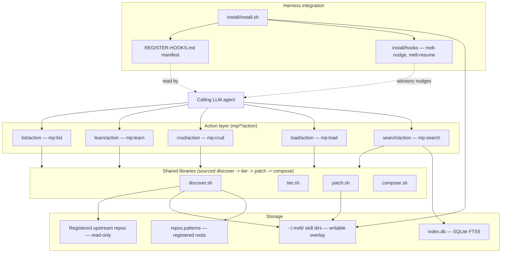
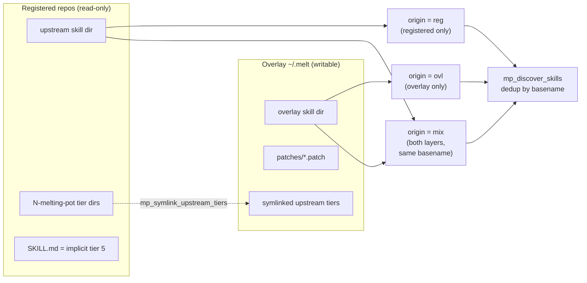
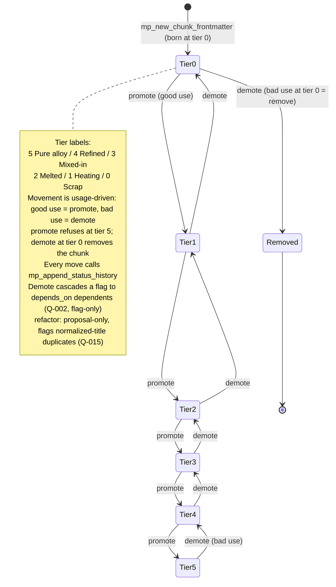
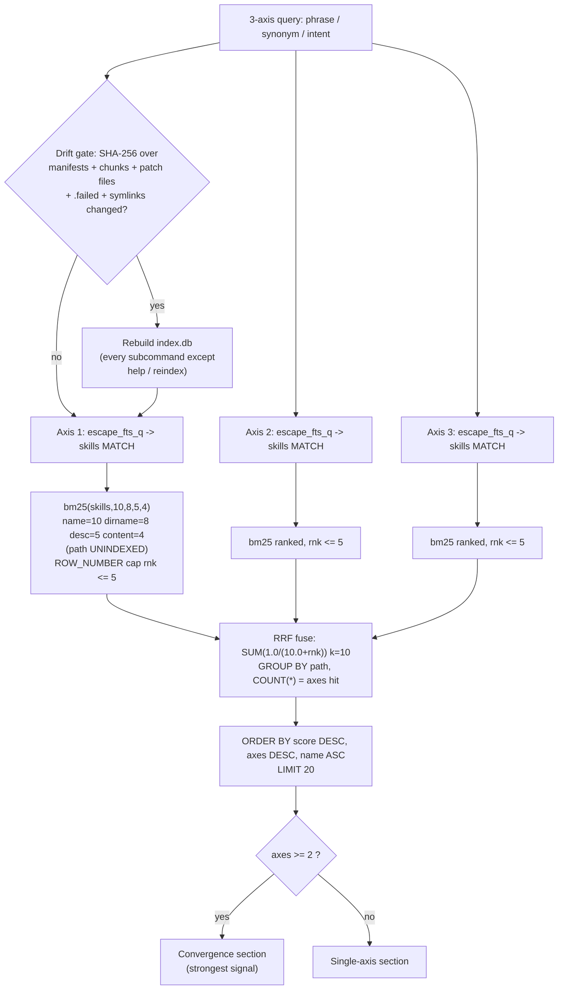
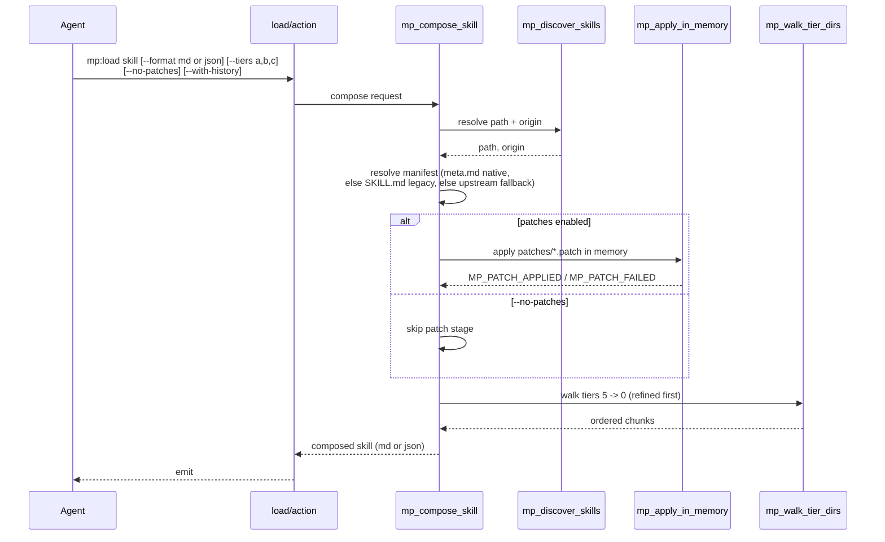
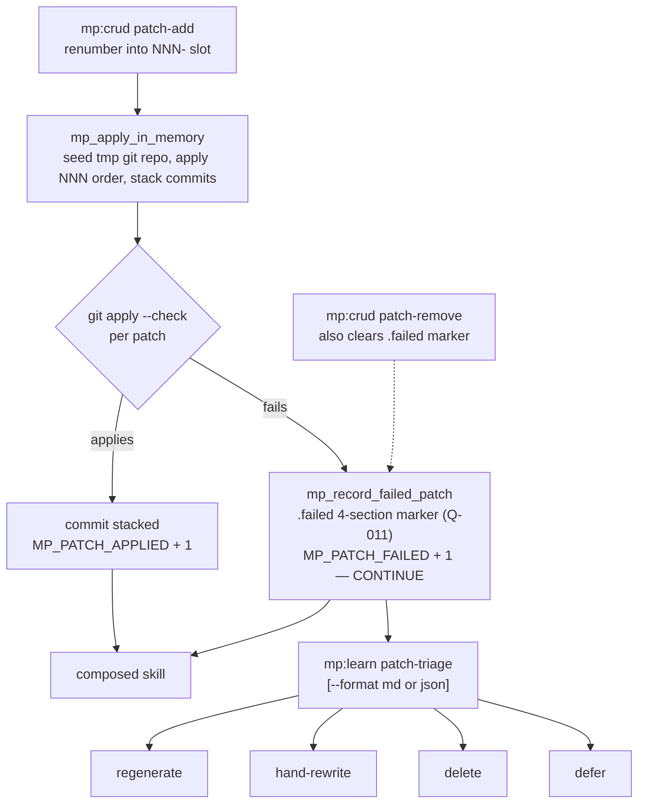
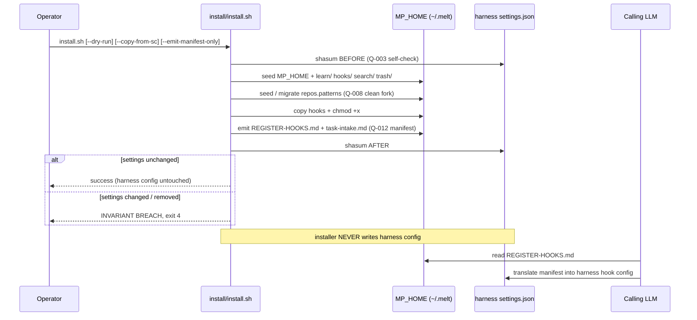
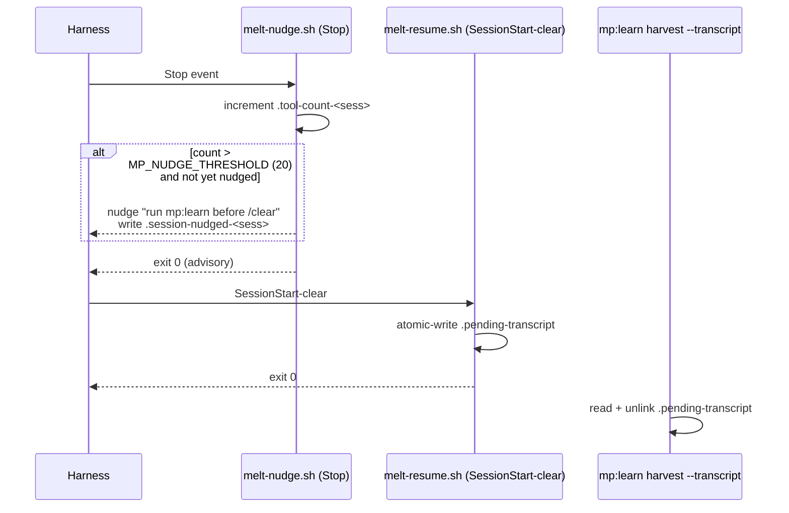

# melting-pot — What It Is and How It Works

> An explanatory report for the repo owner. Every diagram label below is a real file or
> function from the codebase. Where the plan files and the code disagree, this report
> follows the code and calls out the drift in §12.

---

## 1. What melting-pot is

**melting-pot** is a vendor-neutral, file-based *skill store*. A "skill" is a reusable
procedure written in Markdown — a recipe that an LLM agent can load and follow. The store
discovers skills from a set of registered repositories plus a private writable workspace,
indexes them for full-text search, and serves them on demand. It is implemented in plain
POSIX `sh` over SQLite's FTS5 full-text engine, leaning only on binaries that ship with
macOS (`sqlite3`, `shasum`, `git`). There is no runtime, no package manager, no daemon — a
handful of shell scripts and a SQLite file.

Lineage matters here: melting-pot is a **clean fork of `sc:*` (skill-core)**. It inherits
skill-core's search-and-serve model but rebuilds it around a *gradient* metaphor — skills
are not flat files, they are alloys that get refined over time. The name is literal: raw
material (scrap) is melted, heated, mixed, and eventually refined into a pure alloy. That
gradient is the spine of the whole system.

The store exposes **five meta-skills** — `mp:search`, `mp:load`, `mp:crud`, `mp:learn`, and
a `mp:list` helper — implemented as `action` scripts in `mp/<skill>/`, sitting on top of
**four shared libraries** in `mp/lib/`. A calling LLM agent invokes these skills; melting-pot
itself never runs an agent. It is a library the agent reaches into.

---

## 2. The five core ideas

**1. A six-tier refinement gradient.** Every skill is split into *chunks*, and each chunk
lives at a tier from `0` to `5`, stored in directories `0-melting-pot/` through
`5-melting-pot/`. The labels run from raw to refined: `5 = Pure alloy`, `4 = Refined`,
`3 = Mixed-in`, `2 = Melted`, `1 = Heating`, `0 = Scrap`. New material is born at tier 0 and
*earns promotion* upward (or gets demoted) as evidence about its usefulness accumulates.

**2. A two-layer storage model.** Skills come from **registered repos** (read-only, you don't
own them) and a **writable overlay** at `~/.melt/`. A skill's `origin` is `reg` (only in a
registered repo), `ovl` (only in the overlay), or `mix` (present in both — the overlay
customizes upstream). This lets you adopt skills you don't control and still refine them.

**3. In-memory git patches.** To customize an upstream skill you don't own, melting-pot keeps
a stack of `.patch` files and applies them *in memory* at load time — never touching the
read-only source. Patch application is deliberately **policy-free**: a patch that fails to
apply doesn't abort the load; it records a `.failed/` marker and the pipeline continues.

**4. A lifecycle engine.** `mp:learn` harvests new chunks from transcripts, promotes/demotes
chunks against declared rules, cleans up stale scrap, flags refactor candidates, and triages
broken patches. This is what turns the gradient from a static label into a living process.

**5. Harness-agnostic integration.** The installer and hooks are designed so melting-pot
**never mutates the host harness's configuration**. The installer emits a Markdown *manifest*
describing what hooks should be registered; the calling LLM reads that manifest and translates
it into whatever config its harness uses. An installer self-check (Q-003) hard-fails if the
harness settings file changes during install.

---

## 3. System architecture

Two action layers (search + load) sit on four libraries, which read three storage areas. CRUD
and learn extend the same foundation; hooks and the installer wire melting-pot into a host
agent without owning it.



Both `search/action` and `load/action` source **all four** libraries (in the order
`discover.sh` -> `tier.sh` -> `patch.sh` -> `compose.sh`), so every action has the full toolkit
available even when it only uses part of it.

---

## 4. The two storage layers and the origin model

melting-pot reads skills from two places. **Registered repos** are listed in `repos.patterns`
and are treated as read-only upstream. The **overlay** at `~/.melt/` is the one place
melting-pot writes — new skills, customizations, patches, and harvested chunks all land here.

`mp_discover_skills` (the central discovery function in `discover.sh`) makes two passes — the
overlay first, then the registered roots — and **dedups by basename**. The result is a TSV
stream of `path \t origin \t kind`, where `origin` is one of `reg / ovl / mix` and `kind` is
one of `legacy / native`. A skill present in both layers is `mix`: the overlay refines upstream
you don't own.

The bridge between layers is `mp_symlink_upstream_tiers` (resolved as Q-007): when an upstream
repo ships `N-melting-pot/` tier directories, discovery symlinks them into the overlay so the
tier walker sees a unified gradient regardless of which layer a chunk physically lives in.



A skill's display name comes from `mp_name_from_dirname`, which converts the **first** `-` in a
directory name to `:` and leaves the rest — so `git-rebase` becomes `git:rebase`. The manifest
is resolved by `mp_manifest_path`: a `meta.md` makes the skill **native** (and wins), otherwise
a `SKILL.md` makes it **legacy**.

---

## 5. The six-tier gradient and chunk lifecycle

A chunk is born at **tier 0** with frontmatter written by `mp_new_chunk_frontmatter`. From
there it moves up and down the gradient under the control of `mp:learn`, driven purely by
**usage quality** (Q-005): a **good use promotes** it one tier, a **bad use demotes** it one
tier, and a **bad use at tier 0 removes** it from the pot. There are no `promote_when` /
`demote_when` rules and no time-decay. The tier-walking helpers clamp every move to `0..5`
(promote refuses at 5). Each move appends to an append-only `status_history` list; demoting a
chunk first cascades a flag to its dependents.



`mp_walk_tier_dirs` walks tiers `0 -> 5` (alphabetical within a tier), and treats a bare
`SKILL.md` as tier 5. `mp_resolve_chunk_path` resolves a chunk to its **highest** present tier
(refined copies shadow raw ones). `mp_avg_tier` gives a skill its rollup tier for the index.

Tier movement carries **no rules and no thresholds** (Q-005 resolved 2026-05-29): the caller
decides good-vs-bad and calls `promote` / `demote` directly. The chunk frontmatter is: `title`,
`created`, `last_used`, `use_count`, `provenance` (list), `depends_on` (list), and
`status_history` (list of `{tier, at, reason}`). `use_count` / `last_used` are **informational
only** — they no longer gate movement.

---

## 6. The search pipeline

`mp:search` takes a **three-axis** query (a literal phrase, a synonym/jargon framing, and an
intent/goal framing). Each axis is searched independently against the FTS5 index, the top
results per axis are capped, and the three rankings are fused with **Reciprocal Rank Fusion**
so skills that surface on multiple axes win. The whole thing is gated by an auto-reindex check
that rebuilds the index whenever the on-disk corpus has drifted.



The bm25 column weights — `name=10, dirname=8, description=5, content=4` — are **correctly
aligned** with the FTS index column order (this was suspected to be off but verified correct;
`path` is deliberately unindexed). The index also carries per-skill metadata computed at
reindex time: `origin`, `avg_tier`, `hits`, `patches_applied`, `patches_failed`.

---

## 7. The load / compose path

`mp:load` composes a single skill for delivery to the agent. It discovers the skill's path and
origin, resolves the manifest (falling back to upstream when the overlay lacks one), applies
in-memory patches unless told not to, then walks the tiers from refined down to raw and emits
the result as Markdown or JSON.



---

## 8. The patch system and failure triage

melting-pot customizes upstream skills it does not own with a numbered stack of `.patch` files.
`mp_apply_in_memory` seeds a throwaway git repo (with the upstream content as `upstream.md`),
applies each `patches/NNN-*.patch` in numeric order, and stacks the results as commits. The
design is **policy-free**: a patch that fails to apply does *not* stop the run — it records a
four-section marker under `.failed/` (Q-011) and **continues** with the next patch. Those
failures are surfaced later by `mp:learn patch-triage`.



Related CRUD commands: `patch-list` (reports `failed` / `not-yet-attempted`), `patch-validate`
(dry-run apply — the **only** command that reports `applies`), and `patch-remove` (which also
clears any `.failed` marker for that patch).

---

## 9. Install and harness-agnostic integration

`install/install.sh` (a `/bin/sh` script run with `set -u`) sets up the overlay and hooks but
**never writes the host harness's configuration**. It seeds `$MP_HOME` (`~/.melt`) with the
`learn/`, `hooks/`, `search/`, and `trash/` subdirs; seeds or migrates `repos.patterns` (a clean
fork — Q-008 — with an optional one-time `cp` from `~/.sc` under `--copy-from-sc`); copies and
`chmod +x` the hooks; and **emits a Markdown manifest** (`REGISTER-HOOKS.md` plus
`task-intake.md`). The calling LLM reads that manifest and translates it into its own
harness-specific hook config. A self-check (Q-003) `shasum`s the harness settings file before
and after; if it changed or vanished, the installer aborts with **"INVARIANT BREACH" exit 4**.



---

## 10. Hooks lifecycle

Two hooks live in `install/hooks/`. Both are `/bin/sh`, both **always exit 0**, and both are
purely **advisory** — they nudge the agent but never block it.

- **`melt-nudge.sh`** fires on the harness `Stop` event. It keeps a per-session tool counter
  (`.tool-count-<sess>`); once the count crosses `MP_NUDGE_THRESHOLD` (default 20) it nudges the
  agent to run `mp:learn` before `/clear`, and drops a once-per-session marker
  (`.session-nudged-<sess>`) so it only nudges once.
- **`melt-resume.sh`** fires on `SessionStart:clear`. It atomically writes a `.pending-transcript`
  handshake file; later, `mp:learn harvest --transcript` **reads and unlinks** that file to pull
  the just-cleared transcript into the harvest pipeline.



---

## 11. Testing and quality

The test harness `test/run-tests.sh` sandboxes a throwaway `MP_HOME` (via `mktemp`) so tests
never touch a real install. It defines **97 test functions**, and the suite was run during
review: **97/97 PASS, exit 0** (verified, not assumed).

| Phase | Area | Tests |
|---|---|---|
| LIB | discover / tier / patch / compose | 26 (DISC 7, TIER 9, PATCH 6, COMPOSE 4) |
| PHASE 2 | search | 15 |
| PHASE 3 | list + crud | 19 (LIST 7, CRUD 12) |
| PHASE 4 | load | 9 |
| PHASE 5 | learn | 16 |
| PHASE 6 | install | 8 |
| PHASE 7 | corpus | 4 |
| **Total** | | **97** |

**Fixtures** (`test/skills/`): 79 directories — 77 legacy `SKILL.md` skills, 1 `mix`
(`git-rebase`: a `SKILL.md` plus `0/3` populated tier dirs), and 1 pure native
(`melting-pot-native-demo`: a `meta.md` plus `0/5` populated tier dirs). Broken-patch scenarios
are built by in-test helpers at runtime rather than committed as fixtures.

**Golden set** (`test/golden/`): `RUBRIC.md` grades relevance `2 / 1 / 0` (with an implicit
`-1`). `queries.tsv` has 6 columns (`qid, axis1, axis2, axis3, target_skill, grade`), 119 data
rows across 55 qids. Important caveat: the named metrics — `precision@1`, `precision@3`, `MRR`,
`NDCG@5` — are **spec-only**. There is no executable runner; `llm_tests.md` describes a runner
that has **not been built**.

---

## 12. Build status and known issues

This section is deliberately honest. The code is real, tested, and largely matches its spec —
but the planning ledger has drifted from the code, and there are three genuine defects.

| # | Issue | Severity | Detail |
|---|---|---|---|
| 1 | **Build-status drift** | Docs | `plans/build_order.md` shows Phases 1-7 implementation checkboxes all `[ ]` (unstarted) while ~7,118 lines of code and 97 passing tests exist on disk. Phase 8 is `[ ]` though `REPORT.md` calls it done. Corpus size is stated three ways: 54 (plan) / 78 / **79 (actual)**. |
| 2 | **Q-014 false claim** | Real defect | `open_questions.md` says `mp_append_status_history` is idempotent and regression-tested. The code refutes this: `mp_append_status_history` (`tier.sh:248,252,273`) appends unconditionally with no dedup, and no `*_idempotent` test exists. Promote/demote twice on the same day duplicates a `status_history` row. |
| 3 | **Harvest DSL bug** | Fixed 2026-05-29 | Previously `mp_new_chunk_frontmatter` wrote `promote_when` as a DSL string the evaluator couldn't parse. Resolved by the Q-005 change: the rule blocks (and the evaluator) were removed entirely, so harvested and scaffolded chunks now share the same rule-free frontmatter. |
| 4 | **patch-list doc wording** | Minor docs | `crud/SKILL.md` says `patch-list` reports `applies / failed / not-yet-attempted`, but `patch-list` only reports `failed / not-yet-attempted`; `applies` comes from `patch-validate`. |

For completeness: the bm25 column weights were *suspected* to be misaligned but were verified
**correct** — that is **not** a defect.

**Open questions** (`plans/open_questions.md`): 8 resolved invariants (Q-001 policy-free patch +
`.failed` + triage; Q-003 harness-agnostic installer; Q-005 usage-driven promote/demote — no
rule grammar; Q-007 `N-melting-pot` tier dirs + symlink + `SKILL.md`@tier5; Q-008 clean-fork
`repos.patterns`; Q-012 markdown manifest; Q-013 bundled installer; Q-014 status_history
idempotency — *see defect #2*). 7 still open, all v1-defaulted: Q-002 (cascade flag-only),
Q-004 (use_count load-time write), Q-006 (harvest provenance JSON — highest stakes), Q-009
(full tier mobility), Q-010 (nudge per-session throttle), Q-011 (`.failed` schema), Q-015
(refactor title-only).

---

## 13. Glossary and file map

| Term | Meaning |
|---|---|
| **Chunk** | One tiered piece of a skill, living in `N-melting-pot/`. |
| **Tier** | Refinement level `0..5`: 0 Scrap, 1 Heating, 2 Melted, 3 Mixed-in, 4 Refined, 5 Pure alloy. |
| **Origin** | `reg` (registered only), `ovl` (overlay only), `mix` (both). |
| **Kind** | `native` (`meta.md`, wins) or `legacy` (`SKILL.md`). |
| **Overlay** | The writable store at `~/.melt/` (`$MP_HOME`). |
| **Manifest** | `meta.md` or `SKILL.md` describing a skill; also the install-time `REGISTER-HOOKS.md`. |

```
mp/
  search/{action,SKILL.md}    mp:search — 3-axis FTS5 + RRF
  load/{action,SKILL.md}      mp:load   — compose a skill
  crud/{action,SKILL.md}      mp:crud   — scaffold/validate/trash/restore/patch-*
  learn/{action,SKILL.md}     mp:learn  — harvest/promote/demote/refactor/cascade/patch-triage
  list/{action,SKILL.md}      mp:list   — flat catalog
  lib/
    discover.sh   mp_discover_skills, mp_name_from_dirname, mp_manifest_path,
                  mp_symlink_upstream_tiers, mp_log
    tier.sh       mp_walk_tier_dirs, mp_avg_tier, mp_resolve_chunk_path,
                  mp_append_status_history, mp_new_chunk_frontmatter
    patch.sh      mp_apply_in_memory, mp_record_failed_patch, mp_validate_patch,
                  mp_clear_failed_marker
    compose.sh    mp_compose_skill, mp_tier_label, _mp_compose_md, _mp_compose_json
install/
  install.sh                  seed overlay, hooks, manifest; Q-003 self-check
  hooks/melt-nudge.sh         Stop-event nudge to run mp:learn
  hooks/melt-resume.sh        SessionStart:clear transcript handshake
  REGISTER-HOOKS.md           emitted hook-registration manifest
  task-intake.md              emitted intake guidance
test/
  run-tests.sh                97 sandboxed test functions (97/97 pass)
  skills/                     79 fixture skill dirs
  golden/                     RUBRIC.md, queries.tsv (spec-only metrics)
plans/
  architecture.md  build_order.md  open_questions.md  llm_tests.md
```
