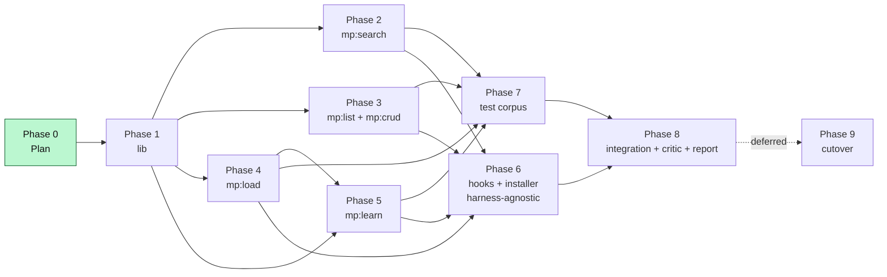

# melting-pot — build order

> Phased checkboxes. Status markers are load-bearing: `[ ]` = not started, `[~]` = in progress, `[x]` = done. **Nothing is done until tests pass.**

See `architecture.md` for the hub diagram and contracts. See `open_questions.md` for blocking questions.

## Cherry-pick map — from skill-core/sc/

Survey of every file in `/Users/coding/Projects/skill-core/sc/` and `/Users/coding/Projects/skill-core/test/`, classified by reuse mode. **Reflects Q-001/003/007/008 resolutions.**

### Lift verbatim (battle-tested — copy then rename `sc_*` → `mp_*`)

| Source | Destination | Notes |
| --- | --- | --- |
| `sc/lib/discover.sh` — `sc_warn`, `sc_err` | `mp/lib/discover.sh` (rename to `mp_*`) | Output helpers, unchanged. |
| `sc/lib/discover.sh` — `sc_sql_esc` | `mp/lib/discover.sh` | `sed "s/'/''/g"` — unchanged. |
| `sc/lib/discover.sh` — `sc_expand_root` | `mp/lib/discover.sh` | `~`-expansion. Unchanged. |
| `sc/lib/discover.sh` — `sc_parse_patterns` | `mp/lib/discover.sh` | `<root>\t<pattern>` parsing. Unchanged (still reads `~/.melt/repos.patterns` only — no fallback). |
| `sc/lib/discover.sh` — `sc_fm_field`, `sc_body_after_fm`, `sc_has_frontmatter` | `mp/lib/discover.sh` | Frontmatter readers. Unchanged. |
| `sc/lib/discover.sh` — `sc_name_from_dirname` | `mp/lib/discover.sh` | First-`-`-to-`:` rule. Unchanged. |
| `sc/lib/discover.sh` — `sc_json_escape` | `mp/lib/discover.sh` | Unchanged. |
| `sc/search/action` — `sc_resolve` (symlink chase) | every `mp/*/action` | Unchanged. Required because `~/.melt/<skill>/action` will be a symlink. |
| `sc/search/action` — `escape_fts_q` | `mp/search/action` | OR-joined token sanitizer. Unchanged. |
| `sc/search/action` — RRF SQL block (per-axis ROW_NUMBER + `bm25(skills,10,8,5,4)` + capped top-5 + `SUM(1.0/(10.0+rnk))`) | `mp/search/action` | **Core ranking algorithm.** Unchanged. |
| `sc/search/action` — atomic reindex (`index.db.tmp` → `mv`) | `mp/search/action` | Unchanged. |
| `sc/search/action` — `compute_skills_hash` + `auto_reindex_if_changed` | `mp/search/action` | Hash inputs extended (see below). |
| `sc/search/action` — `cmd_doctor` | `mp/search/action` | Unchanged shape; messages mention `.melt` not `.sc`. |
| `sc/crud/action` — `cmd_collision_check`, `cmd_scaffold`, `cmd_validate`, `cmd_trash`, `cmd_restore`, `cmd_import_preview` | `mp/crud/action` | Shape unchanged; scaffold targets native six-tier layout with `-melting-pot` suffix (see "lift-and-adapt"). |
| `sc/list/action` (all of it) | `mp/list/action` | Unchanged shape; output adds `tiers_present`, `origin`, `patches_failed_count` columns (see "lift-and-adapt"). |
| `test/run-tests.sh` (harness: `t_setup`, assertion helpers, sandboxed `$SC_HOME`) | `test/run-tests.sh` | Rename `$SC_HOME` → `$MP_HOME`. T-01..T-33 patterns reusable. |
| `test/golden/RUBRIC.md` | `test/golden/RUBRIC.md` | Unchanged. |
| `test/golden/queries.tsv` (the 39-skill fixture set + grades) | `test/golden/queries.tsv` | Reusable as-is for the carry-over fixtures. Add new rows for tier-aware + patched-content queries. |

### Lift and adapt (shape reusable, semantics change for six-tier / overlay / patches / Q-007 renames)

| Source | Destination | Adaptation |
| --- | --- | --- |
| `sc/lib/discover.sh` — `sc_discover_skills` | `mp/lib/discover.sh` — `mp_discover_skills` | **Union two layers + symlink upstream tier dirs.** Walks registered roots (for `SKILL.md` OR `meta.md`) AND the overlay root (`~/.melt/<skill>/`). For any registered repo containing `N-melting-pot/` dirs, creates symlinks `~/.melt/<skill>/N-melting-pot/ → <upstream-path>/N-melting-pot/` (Q-007). Each discovered skill carries an `origin` tag (`reg`/`ovl`/`mix`) and a "full-overlay-mode" flag (Q-007). |
| `sc/search/action` — `cmd_reindex` content-extraction loop | `mp/search/action` — `cmd_reindex` | Per skill, walk **all tier dirs (`0-melting-pot/`..`5-melting-pot/`)** in overlay (which now also includes symlinked upstream tier dirs from Q-007), concatenate chunk bodies. Then `mp_apply_patches` rewrites the upstream slice in-memory — patch failures are recorded to `~/.melt/<skill>/patches/.failed/` and apply continues with the next patch (Q-001). The patched, unioned blob is what gets indexed. |
| `sc/search/action` — `cmd_search` text-format output | `mp/search/action` — `cmd_search` text-format | Add per-row `origin=reg|ovl|mix`, `avg_tier=<n.n>`, `hits=[t:n, t:n, …]`, and `patches=N applied [failed=M]` line. |
| `sc/search/action` — `compute_skills_hash` | `mp/search/action` — `mp_compute_skills_hash` | Hash inputs extended to include `<path>+<content>` for every chunk under every `N-melting-pot/` dir AND every `patches/*.patch` AND every `.failed/` marker AND every `meta.md` AND every symlink target. Drift in any of these triggers reindex. |
| `sc/crud/action` — `cmd_scaffold` | `mp/crud/action` — `cmd_scaffold` | Default scaffold writes `meta.md` + `0-melting-pot/first.md` (native six-tier, Q-007 naming). `--legacy` flag preserves the old `SKILL.md` shape for users targeting third-party registries that expect it. |
| `sc/crud/action` — `cmd_validate` | `mp/crud/action` — `cmd_validate` | Adds: tier dirs must be named exactly `0-melting-pot`..`5-melting-pot` (Q-007); every chunk has frontmatter; every `patches/*.patch` parses as a valid git diff; `depends_on` references resolve; `.failed/` marker files (if present) have the expected envelope shape. |
| `sc/list/action` row schema | `mp/list/action` row schema | TSV gains `tiers_present` (e.g. `[0,2,5]-melting-pot`), `chunk_count`, `patches_count`, `patches_failed_count`, `origin`. Text format groups by `origin` first, then by root. |

### Author fresh (no analogue in sc:*)

| Component | Why fresh | Notes |
| --- | --- | --- |
| `mp/lib/tier.sh` | New concept | `walk_tier_dirs <skill-dir>` (recognises only `N-melting-pot/`), `resolve_chunk_path`, `append_status_history`, `read_tier_meta` (parses `depends_on`, `use_count`, `last_used`), `detect_full_overlay_mode <skill>` (Q-007 partial-coverage rule). |
| `mp/lib/patch.sh` | New concept | `list_patches <skill>`, `apply_in_memory <upstream-file> <patch-list>` → stdout, `validate_patch <patch>` (parse-only), `record_failed_patch <skill> <patch-id> <reject-output> <upstream-excerpt>` (Q-001 — writes envelope to `~/.melt/<skill>/patches/.failed/<patch-id>.patch.failed`), `patch_status <skill>` → TSV (`patch-id\tstatus`: `applies` / `failed` / `not-yet-attempted`). Uses `git apply --check` on tmp dirs. **Apply pipeline is policy-free** — never auto-skips or auto-stops; just records and continues. |
| `mp/lib/compose.sh` | New concept | `compose_skill <skill-name> --format md|json --tiers ... --no-patches --with-history` — the body of `mp:load`. |
| `mp/load/{SKILL.md, action}` | New skill | Implements `mp:load <skill-name>`. Delegates heavy lifting to `compose.sh`. |
| `mp/learn/{SKILL.md, action}` | New skill | Lifecycle scripts (`promote`/`demote`/`refactor`/`cascade`/`harvest`/**`patch-triage`** [new per Q-001]). Usage-driven promote/demote, no rules (Q-005). Largest single piece of new code. |
| `mp/crud/action patch-*` subcommands | New concept | `patch-add`, `patch-list` (marks `applies`/`failed`/`not-yet-attempted`), `patch-validate` (read-only, does NOT write `.failed/` markers), `patch-remove` (also clears matching `.failed/` marker). |
| `install/install.sh` (renamed from `install-claude-md.sh`) | New | Bundled installer (Q-013) — seeds `~/.melt/`, copies hooks, emits BOTH `install/REGISTER-HOOKS.md` (hooks manifest, Q-012) AND `install/task-intake.md` (global-rule block) for the calling LLM to install harness-specifically. Q-003: does NOT mutate harness config. `--copy-from-sc` flag for one-time migration from `~/.sc/repos.patterns` (Q-008). `--dry-run` flag. |
| `install/REGISTER-HOOKS.md` | New | **Sole** hook manifest (Q-012 — markdown only, no JSON, no stdout TSV mode). Structured tables: `script-path` / `hook-event-slot` / `description` / `install-target-hint`. The calling agent reads and translates into harness-specific config. |
| `install/hooks/melt-nudge.sh` | New | **Harness-agnostic** POSIX sh (Q-003). Emits plain stdout — no Claude-Code-specific JSON. |
| `install/hooks/melt-resume.sh` | New | **Harness-agnostic** POSIX sh (Q-003). Emits plain stdout. |
| `install/task-intake.md` | New | Global-rule text block; the calling agent appends it to whatever the harness uses as its global rules file. |
| Frontmatter schema for chunks | New | Each chunk's `---` block declares `title`, `created`, `last_used`, `use_count`, `provenance`, `depends_on`, `status_history`. No `promote_when`/`demote_when` (Q-005: usage-driven movement); `use_count`/`last_used` are informational only. |

## Phases

### Phase 0 — Plan & scaffolding (Architect)

- [x] Draft `plans/architecture.md` (hub diagram, contracts, file layout)
- [x] Draft `plans/build_order.md` (this file, cherry-pick map, phases)
- [x] Draft `plans/open_questions.md` (Q-001..Q-010)
- [x] User answers blocking Q-IDs (Q-001/003/007/008 resolved 2026-05-20; spawned Q-011/Q-012/Q-013 for the post-resolution details)
- [x] Plan files updated to reflect Q-001/003/007/008 resolutions
- [x] User resolves Q-012 (markdown-only manifest) + Q-013 (bundled installer) 2026-05-20; Q-014 closed as fixed-in-code; Q-015 logged as deferred enhancement
- [x] Plan files updated to reflect Q-012/013/014/015 (this revision)
- [x] Architect green-lights Phase 1 (Backend-Lib already shipped Phase 1)

### Phase 1 — Shared library (Backend-Lib)

Foundation everything else depends on. **Blocks Phases 2 / 3 / 4.**

- [ ] `mp/lib/discover.sh` — lift `sc/lib/discover.sh` verbatim, rename `sc_*` → `mp_*`. Extend `mp_discover_skills` to:
  - Union registered + overlay layers (return TSV per skill: `path<TAB>origin<TAB>kind` where `kind` ∈ `legacy|native`).
  - **Symlink upstream `N-melting-pot/` dirs into `~/.melt/<skill>/N-melting-pot/` (Q-007).**
  - **Read only `~/.melt/repos.patterns` (Q-008) — no fallback to `~/.sc/`.**
- [ ] `mp/lib/tier.sh` — author fresh. `walk_tier_dirs <skill-dir>` emits `tier<TAB>path` rows; **recognises ONLY `N-melting-pot/` (Q-007)**, ignores bare `N/` dirs. `resolve_chunk_path <skill> <chunk-name>` returns the highest-tier copy. `append_status_history <chunk> <tier> <reason>` writes a new history entry without rewriting frontmatter from scratch (use awk in-place edit on the `status_history:` block). `detect_full_overlay_mode <skill>` returns 0 if upstream has any `N-melting-pot/` dirs (so the overlay owns the whole tier stack).
- [ ] `mp/lib/patch.sh` — author fresh (Q-001 shape). `list_patches <skill>` sorted by numeric prefix. `apply_in_memory <upstream> <patch-list>` writes patched content to stdout via tmp-dir `git init` + `git apply` workflow. **On failure: call `record_failed_patch` and continue with the next patch** (never auto-skip-stack, never auto-stop). `record_failed_patch <skill> <patch-id> <reject-output> <upstream-excerpt>` writes envelope to `~/.melt/<skill>/patches/.failed/<patch-id>.patch.failed` (delimited sections — see Q-011). `patch_status <skill>` → TSV.
- [ ] `mp/lib/compose.sh` — author fresh. Reads manifest + walks `N-melting-pot/` tiers + applies patches + emits markdown/json. Tier order 5→0 by default, alphabetical within tier.
- [ ] Unit-style smoke tests: each lib function has at least one `t_LIB_NN` test in `test/run-tests.sh`. **Specific coverage required:** symlink creation when upstream has `N-melting-pot/` dirs (Q-007), patch-apply continues past first failure with marker recorded (Q-001), no read from `~/.sc/repos.patterns` (Q-008).

### Phase 2 — mp:search (Backend-Skills-A, parallel with Phase 3)

- [ ] `mp/search/action` — copy `sc/search/action` shape; swap `SC_*` → `MP_*` paths and helper names.
- [ ] Extend `cmd_reindex` to call `mp_walk_tier_dirs` + `mp_apply_patches` per skill, concatenating chunk bodies into the single FTS5 `content` column. Per-skill metadata columns: `origin`, `avg_tier`, `hits_json`, `patches_applied`, `patches_failed` (count of `.failed/` markers).
- [ ] Extend `compute_skills_hash` to include chunk paths/contents AND patch paths/contents AND `.failed/` marker contents AND `meta.md` AND symlink targets (Q-007).
- [ ] Extend `cmd_search` text output to render `origin`/`avg_tier`/`hits`/`patches=N applied [failed=M]` per row. JSON/TSV gain those fields.
- [ ] Keep RRF SQL block intact (the proven `bm25(skills, 10, 8, 5, 4)` + top-5 cap + `SUM(1/(10+rnk))` formula).
- [ ] `mp/search/SKILL.md` — adapt from `sc/search/SKILL.md`; mention the new metadata columns; preserve the **three-axis rule**.
- [ ] Tests: T-01..T-14 (flag/arg) carry over. New: T-S-01 (`origin=mix` shows up). T-S-02 (`patches=N applied [failed=M]` reported). T-S-03 (`hits=[5:n, 3:m, 0:k]` formatting). T-S-04 (drift in `patches/` or `patches/.failed/` triggers reindex). T-S-05 (upstream with `N-melting-pot/` dirs is indexed via symlink, not direct traversal).

### Phase 3 — mp:list, mp:crud (Backend-Skills-B, parallel with Phase 2)

- [ ] `mp/list/action` — copy `sc/list/action` shape; extend rows with `origin`, `tiers_present` (e.g. `[0,2,5]-melting-pot`), `chunk_count`, `patches_count`, `patches_failed_count`.
- [ ] `mp/crud/action` — copy `sc/crud/action`; add `--legacy` flag to `cmd_scaffold` (default = native six-tier with `-melting-pot` suffix per Q-007).
- [ ] `mp/crud/action` — extend `cmd_validate` to check tier dir names are `N-melting-pot/` (Q-007) + chunk frontmatter + patch parse-ability + `.failed/` marker envelope shape.
- [ ] `mp/crud/action` — add `patch-add`, `patch-list`, `patch-validate` (read-only, no `.failed/` writes), `patch-remove` (also clears `.failed/`) subcommands (use `lib/patch.sh`).
- [ ] `mp/list/SKILL.md`, `mp/crud/SKILL.md` — adapt from sc counterparts. CRUD's SKILL.md documents the new patch-* subcommands, the `-melting-pot` tier-dir naming, and the native-six-tier scaffold default.
- [ ] Tests: T-L-01..05 (list rows include new columns; tier names include `-melting-pot` suffix). T-C-01..10 (scaffold native + legacy; patch lifecycle including a failed-patch marker round-trip; validate failures including bare `N/` rejection per Q-007).

### Phase 4 — mp:load (Backend-Skills-A) — blocked on Phase 1

- [ ] `mp/load/action` — thin CLI; delegates to `mp/lib/compose.sh`.
- [ ] Resolve `<skill-name>` via `name`-then-dirname lookup against the index.
- [ ] Flags: `--format md|json`, `--tiers 5,3`, `--no-patches`, `--with-history`.
- [ ] `mp/load/SKILL.md`.
- [ ] Tests: T-LD-01..06 (markdown layout matches pitch sample with `-melting-pot` tier headers; tier filter; `--no-patches` shows raw upstream; `--with-history` includes `status_history`; JSON validates).

### Phase 5 — mp:learn (Backend-Skills-B) — blocked on Phase 1 + Phase 4

Largest unit of new code. Decomposes into sub-tasks:

- [ ] `mp/learn/action promote <chunk>` — good use: mv to `<tier+1>-melting-pot/`, append `status_history` entry; refuse at tier 5. No rules (Q-005 resolved: usage-driven, no `promote_when`).
- [ ] `mp/learn/action demote <chunk>` — bad use: mv to `<tier-1>-melting-pot/`; at tier 0, remove the chunk (after cascade-flagging dependents). No rules.
- [ ] `mp/learn/action cascade <chunk>` — walk `depends_on` graph; flag dependents (no auto-demote in v1 — see Q-002).
- [ ] `mp/learn/action refactor` — duplicate detection via FTS5 near-duplicate query; print proposal; `--yes` to act.
- [ ] `mp/learn/action harvest` — live-context mode: emit a structured proposal (`[create]/[promote]/[demote]/[skip]` choices) for the agent to act on. Live-context body is supplied by the agent (via stdin) per Q-006 v1 default.
- [ ] `mp/learn/action harvest --transcript <path>` — transcript mode: read `.jsonl`, same proposal flow.
- [ ] **`mp/learn/action patch-triage` (NEW per Q-001)** — sweep every `~/.melt/*/patches/.failed/` marker; for each marker, parse the envelope (patch hunk / upstream excerpt / reject / timestamp) and emit a structured proposal to the calling LLM: `regenerate` (the LLM rewrites the patch against current upstream), `hand-rewrite` (open the patch in `$EDITOR`), `delete` (rm the patch + marker), `defer` (leave the marker, will re-surface next sweep). LLM decides case-by-case per Q-001.
- [ ] `mp/learn/SKILL.md` — full procedural doc.
- [ ] Tests: T-LR-01..16 (promote +1 / demote -1 / demote-at-0 removal / tier-5 ceiling; refactor proposals; cascade flagging; transcript-mode harvest; **patch-triage end-to-end including `regenerate` / `delete` / `defer` outcomes**).

### Phase 6 — Hooks + installer (DevOps)

**Shape changed substantially per Q-003 (harness-agnostic), Q-012 (markdown-only manifest), Q-013 (bundled installer).**

- [ ] `install/hooks/melt-nudge.sh` — Stop hook. Pure POSIX sh, **harness-agnostic** (emits plain stdout, no harness-specific JSON). Reads `~/.melt/learn/.tool-count-<sess>`, increments, nudges once per session at threshold.
- [ ] `install/hooks/melt-resume.sh` — SessionStart:clear hook. Pure POSIX sh, **harness-agnostic**. Writes prior `.jsonl` path to `~/.melt/learn/.pending-transcript`. Idempotent (atomic write).
- [ ] `install/install.sh` (renamed from `install-claude-md.sh`) — **bundled installer per Q-013**. Seeds `~/.melt/repos.patterns` (with `--copy-from-sc` flag for one-time migration per Q-008), symlinks every `mp/*/action` into `~/.melt/<skill>/action`, copies hooks into `~/.melt/hooks/`, emits BOTH `install/REGISTER-HOOKS.md` (hooks manifest, per Q-012 — markdown only, no TSV mode) AND `install/task-intake.md` (global-rule text the calling agent appends). **Does NOT mutate `~/.claude/settings.json` or any other harness config (Q-003).** `--dry-run` shows actions without writing. No `--emit-hook-manifest` flag (markdown is the sole manifest format).
- [ ] `install/REGISTER-HOOKS.md` — **sole** hook manifest (Q-012). Structured markdown tables — one row per hook with columns: `script-path` / `hook-event-slot` / `description` / `install-target-hint`. The calling LLM reads it and writes the correct harness config (Claude Code: `~/.claude/settings.json`; Cursor: `.cursorrules`; etc.).
- [ ] `install/task-intake.md` — the rule block to append. Bundled installer emits this alongside the hook manifest (per Q-013 — single installer, two emitted artifacts).
- [ ] Tests: T-IN-01..07 (installer is idempotent; `--dry-run` doesn't write; hooks installed once into `~/.melt/hooks/`; `REGISTER-HOOKS.md` emitted with expected tables; `task-intake.md` emitted; **installer does NOT write to `~/.claude/settings.json`** — verify by sandboxing `$HOME`; `--copy-from-sc` migrates `~/.sc/repos.patterns` only when destination is missing; **no `--emit-hook-manifest` flag accepted** — should exit with usage error if invoked).

### Phase 7 — Test corpus (DevOps)

- [ ] Carry over 39 of skill-core's `test/skills/` fixtures verbatim — they're tier-agnostic (legacy `SKILL.md`-only) and exercise the search ranker fine.
- [ ] Add 15 new fixtures that test six-tier layout with `-melting-pot` suffix (Q-007): some with full `0-melting-pot/`..`5-melting-pot/`, some legacy `SKILL.md`-only, some "mix" (legacy `SKILL.md` + overlay tier dirs), some with patches (including a fixture with a deliberately-broken patch to exercise the `.failed/` marker path per Q-001).
- [ ] Carry over `test/golden/RUBRIC.md` verbatim.
- [ ] Extend `test/golden/queries.tsv` with rows that probe `origin=mix` ranking and patched-content matching.

### Phase 8 — Integration + critic + report

- [ ] Full `test/run-tests.sh` passes (~85 tests including new patch-failure / symlink / harness-agnostic-installer coverage).
- [ ] Critic reviews build commit: SOLID compliance, POSIX sh portability (no bashisms), error-handling shape, frontmatter conformance, **Q-001 invariant: apply pipeline is policy-free**, **Q-003 invariant: installer never mutates harness config**, **Q-007 invariant: bare `N/` dirs ignored**.
- [ ] Report synthesises team output for user: what shipped, what's deferred, where the seams are.

### Phase 9 — Cutover (DEFERRED; user decision)

Not in this team's scope per the pitch's "two commits" plan — the cutover is a separate `git mv` after the user validates this build alongside `sc/*`. Tracking placeholder only.

- [ ] User signs off on melting-pot Build commit.
- [ ] `git mv sc sc-legacy` + `git mv mp sc` (or whatever final namespace user picks) in a second commit, on the **skill-core** repo, not here.

## Dependency map

## Status legend

- `[x]` — done & verified (tests pass for that item)
- `[~]` — in progress
- `[ ]` — not started
- `DEFERRED` — out of scope for this team; tracked for completeness

## Notes

- **No commit / push** without explicit user approval. Build commit is one deliverable; team-lead will request approval before staging.
- **`~/.melt` is throwaway in tests.** Every test runs in a sandboxed `$MP_HOME=mktemp -d`, same pattern as sc's harness.
- **Resolved Q-IDs (load-bearing for current implementation):** Q-001 (patch pipeline policy-free + `.failed/` markers), Q-003 (installer harness-agnostic), Q-007 (tier dirs are `N-melting-pot/`), Q-008 (clean fork to `~/.melt/repos.patterns`), Q-012 (`REGISTER-HOOKS.md` markdown-only — no JSON, no TSV mode), Q-013 (bundled `install/install.sh` emits both hooks manifest AND task-intake rule), Q-014 (`mp_append_status_history` idempotency — fixed in code, regression test in `test/run-tests.sh`).
- **Lifecycle automation is still the biggest unknown.** Phase 5 has the most exposure to spec ambiguity — see open_questions.md Q-002, Q-004, Q-006, Q-009, Q-010 (all have v1 defaults; user can override). Q-005 resolved 2026-05-29: usage-driven promote/demote, no rule grammar.
- **Open Q-IDs not blocking current work:** Q-011 (`.failed/` marker on-disk schema — v1 default works for shipped Phase 1), Q-015 (`mp:learn refactor` near-duplicate detection — v1 ships with title-only matching; FTS5 NEAR deferred as future enhancement).
